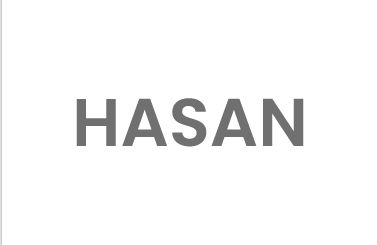
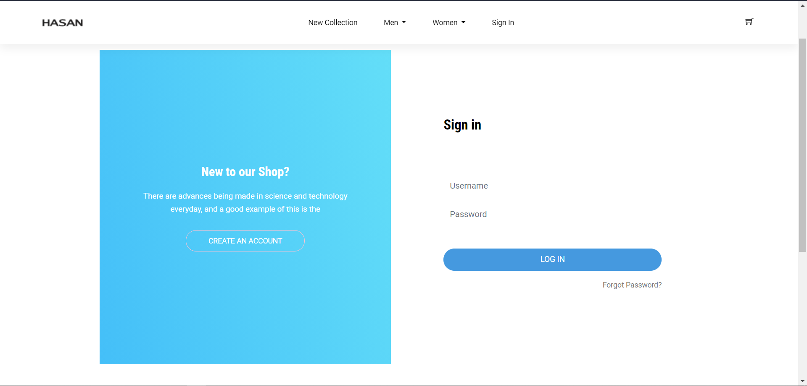
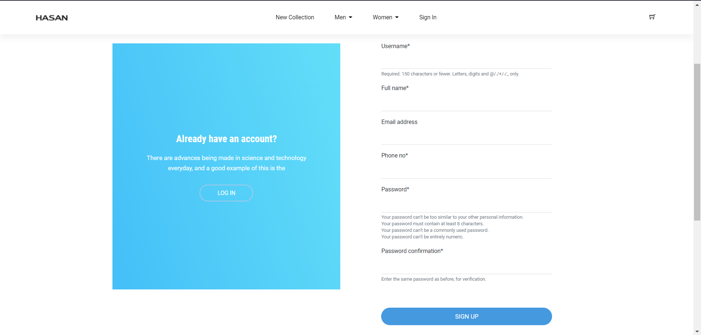
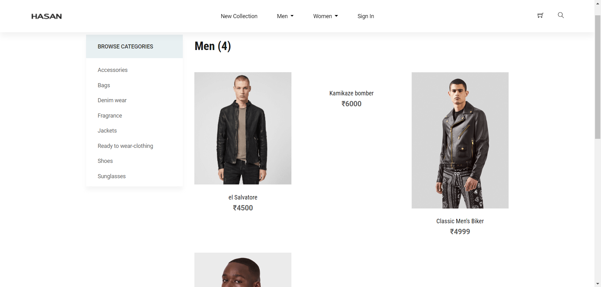
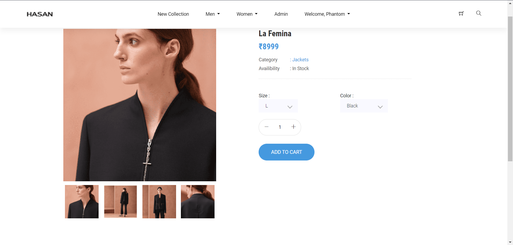
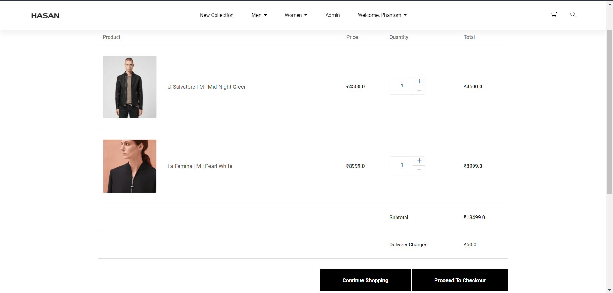

<!-- PROJECT LOGO -->

  

  <h3 align="center">Hasan Ecommerce</h3>
  
  

    A Django based Ecommerce Web Application.
  

<!-- ABOUT THE PROJECT -->
## About The Project

This is an E-Commerce WebApp, that focuses maily on selling Clothes for both Men and Women, and provided access to anyone who wants to log in and but any products from the set of clothes available.

Core Functionalities of the App :
* Complete Login, SignUp, Forgot Password & Change Password.
* Complete Cart Functionality i.e, (Add/Edit & Delete Products).
* Search Products by Name.
* Filter Products based on gender.
* Users can see their history of Orders and Invoices, in the Orders Section. 

Admin Functionality 
* Add Products with Images and description.
* Manage Products ie., (Add/Edit & Delete Products)
* Add & Manage Product Categories.
* As soon as the order has been confirmed by User, an E-Mail will be sent to the provided email containing the invoice.

A list of commonly used resources that I find helpful are listed in the acknowledgements.

### Built With

* [Django](https://www.djangoproject.com/)

## Some Screenshots of the WebApp

Sign In Screen

Sign Up Screen

Products Screen

Product Detail Screen

Cart

<!-- LICENSE -->
## License

Distributed under the MIT License. See `LICENSE` for more information.

<!-- CONTACT -->
## Contact

Harsh Chaurasia - [@linked_in](https://www.linkedin.com/in/harsh-chaurasia)

Email - harshchaurasia58@gmail.com

